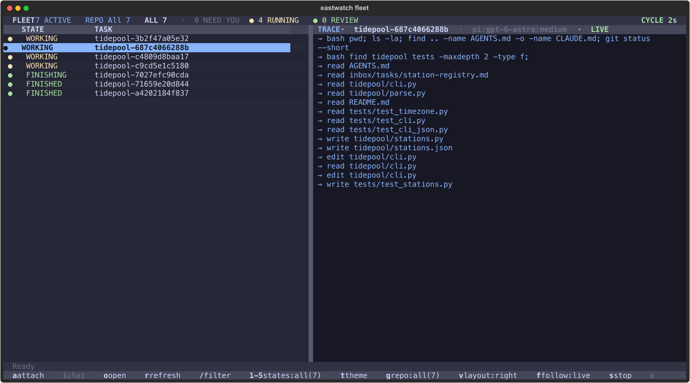

# eastwatch

> **Work in progress.** Eastwatch is a personal tool I run every day, shared as
> is. Config keys, labels, and the hosted mode still change without notice, the
> local watcher is macOS-only, and hosted mode is an early experiment. Expect
> rough edges; issues are welcome, but there are no releases or stability
> guarantees yet.

A Night's Watch for coding agents. Named after Eastwatch-by-the-Sea from Game of
Thrones, it turns issue-board actions into resumable AI coding sessions, with a
TUI to keep watch over the fleet.



_The fleet console watching seven Pi agents on a demo project, running
inside the hardened workspace container from `deploy/workspace/`._

Move an issue into **Ready** (a GitLab label, a GitHub Projects v2 Status, or
an Obsidian TaskNotes `status:`) and Eastwatch claims it, creates a worktree,
and launches a detached `claude` or `pi` worker in tmux. When the worker stops
to ask a question, the issue is parked for you; reply on the issue and the same
session resumes. Finished work lands as a merge request.

It runs in two shapes:

- **Local**: a launchd job on your Mac runs one reconciliation cycle about
  every 15 seconds. Workers run in tmux on the same machine.
- **Hosted (experimental)**: one controller polls the forge and hands jobs to
  a locked-down Docker workspace per person on a Linux server. See
  [Hosted mode](#hosted-mode-experimental).

See [`RUNBOOK.md`](RUNBOOK.md) for the full operating model, state layout,
trigger semantics, recovery procedures, and troubleshooting.

## Quick start (local, macOS)

1. Install [`uv`](https://docs.astral.sh/uv/), `tmux`, and at least one agent
   CLI (`claude` or `pi`) on the PATH exported by `~/.zshenv`.
2. Clone and install. This creates `~/.config/eastwatch/config.yaml` from the
   example and loads the launchd job:

   ```sh
   git clone https://github.com/stanley-910/eastwatch.git
   cd eastwatch
   ./install.sh
   ```

3. Install the bundled Forge skill where workers and the watcher look for it.
   Workers use its `glab-board` helper to claim issues, create worktrees, and
   open merge requests (override the path with `EASTWATCH_GLAB_BOARD`):

   ```sh
   mkdir -p ~/.agents/skills
   ln -s "$PWD/deploy/workspace/skills/forge" ~/.agents/skills/forge
   ```

4. Store the project's bot token in the keychain and fill in the project block
   in `~/.config/eastwatch/config.yaml` (details in [Install](#install)).
5. Check the setup without calling any forge API, then open the fleet console:

   ```sh
   ./eastwatch --preflight
   ./fleet_tui.py
   ```

6. Add the `agent::ready` label to an issue (or drag its card to **Ready**).
   The next cycle adopts existing board state without dispatching, so the
   first run only starts on a label added after the watcher is up.

## Repository layout

Production Python code lives under `src/eastwatch/`:

- `watcher.py` contains reconciliation and worker orchestration.
- `vault.py` contains the `forge: vault` client for a local Obsidian TaskNotes board (see [`docs/vault-provider.md`](docs/vault-provider.md)).
- `fleet/` contains the fleet model, status emitter, TUI, resume, dismiss, and wipe logic.
- `jira/` contains the read-only Jira client and CLI logic.

The root `eastwatch` executable is the source-checkout entrypoint. The old
`watcher.py` command remains as a one-release alias. `fleet_tui.py` and commands
under `scripts/` are thin wrappers. Tests import the package instead of loading
implementation files by path.

## Requirements

- macOS with `launchd` and the `security` keychain CLI
- [`uv`](https://docs.astral.sh/uv/)
- `claude` and/or `pi` on the PATH exported by `~/.zshenv`
- `tmux` for attachable worker sessions (workers can run without it)
- Forge's `glab-board` helper (bundled under `deploy/workspace/skills/forge/`) for issue worktree setup and MR completion
- A GitLab project access token with `api` scope (GitLab projects only)

## Model routing

User-facing model specs remain `provider:model[:effort]`; configuration and
trigger hints do not name Pi's backend provider.

| Spec family | Worker | Route |
|---|---|---|
| `pi:gpt-*[:effort]` | Pi | local `headroom-copilot` first; same model through `github-copilot` on safe fallback |
| `pi:gemini-*[:effort]` | Pi | `github-copilot` directly |
| `pi:claude-*[:effort]` | Pi | `github-copilot` directly |
| `claude:<model>[:effort]` | Claude CLI | unchanged; does not use Pi or Headroom |

Examples: `pi:gpt-5.6-luna:low`, `pi:gemini-3.1-pro-preview:high`,
`pi:claude-sonnet-4.6:high`, and `claude:opus:max`. Both Pi GPT routes consume
the same GitHub Copilot entitlement and quota; fallback is resilience, not extra
capacity. Eastwatch invokes `pi` directly, never the interactive `hpi` shell
wrapper, and does not manage Headroom's lifecycle.

Headroom must already be running and `headroom-copilot` must already be
registered in Pi. See [the runbook](RUNBOOK.md#pi-gpt-routing-through-headroom)
for prerequisites, fallback limits, diagnostics, recovery, and an isolated
smoke test.

## Install

```sh
git clone https://github.com/stanley-910/eastwatch.git ~/Developer/eastwatch
cd ~/Developer/eastwatch
./install.sh
```

The `com.stanwang.*` launchd label is only a reverse-DNS name for the job;
nothing is sent anywhere.

The installer creates the config and state directories, seeds
`~/.config/eastwatch/config.yaml` on first run, renders the tracked
`com.stanwang.eastwatch.plist.example` into the user's LaunchAgents directory,
and loads `com.stanwang.eastwatch`. The rendered machine-specific plist is
not tracked. Re-run the installer after pulling changes that modify the template
or installation behavior.

### Migrating from board-watcher

The installer stops the old launchd job before moving data. It moves
`~/.config/board-watcher` to `~/.config/eastwatch` and
`~/.local/state/board-watcher` to `~/.local/state/eastwatch`, then leaves symlinks
at the old paths for one release. It refuses to move state while a detached
worker run is active or to merge directories when both old and new locations
already contain data.

The `board-watcher` console command, `board_watcher` Python namespace,
`watcher.py` wrapper, and `BOARD_WATCHER_*` environment variables remain as
one-release aliases. Existing `board-watcher-jira-pat` keychain entries and
`<!-- board-watcher: ... -->` merge-request markers are also accepted. New
names take precedence when both environment-variable forms are set. Only
`com.stanwang.eastwatch` runs after installation.

Store the GitLab token in the macOS keychain rather than the config file:

```sh
security add-generic-password \
  -U \
  -a eastwatch \
  -s eastwatch-gitlab-bot \
  -w '<GITLAB PROJECT ACCESS TOKEN>'
```

Then edit `~/.config/eastwatch/config.yaml`. Start from
[`config.yaml.example`](config.yaml.example) and set each project's:

- `host` and namespace-qualified `path`
- numeric GitLab project `id`
- project bot `bot_username` and numeric `bot_user_id`
- machine-local `local_checkout`
- keychain service/account when the project does not use the top-level keychain entry

The numeric project `id` is required; the repository name alone is not enough
for GitLab API calls.

### GitHub projects (Status-first)

A project block with `forge: github` is driven by a GitHub **Projects v2**
board instead of GitLab labels. On GitHub the canonical project's `Status`
single-select is the authoritative state and the only lifecycle command
channel: humans command by dragging a card into **Ready** / **Ready-research**,
and the watcher dispatches on that transition. The `agent::*` / `triage::*`
labels become a watcher-written *shadow* of the last observed Status — a
searchable receipt, never a trigger.

- `forge: github` and a namespace-qualified `path: owner/name`
- `github_project_id` — the canonical project **node id** (`PVT_…`), obtained
  with `glab-board setup --board`. This is required; title-based lookup is
  retired and a missing or malformed id refuses to start.
- `local_checkout` — as with GitLab; the worker worktree is resolved through
  `glab-board start`.
- No keychain entry is needed — GitHub access uses the machine's authenticated
  `gh` CLI (must carry the `project` scope).

The `Status` field must have one option for every open lane, including
`Needs-info`; a renamed or deleted option fails closed. Keep each project's
`triggers:` as `agent::ready` / `agent::ready-research` — the poller maps
Status names through the fixed Status↔label table, so the trigger vocabulary is
identical on both platforms.

### Optional Jira context

Jira enrichment is read-only and disabled by default. Set `jira.enabled: true`
and provide `jira.base_url`. Jira server custom fields are not built into the
code. Add the fields needed by your installation under `jira.custom_fields` as
`display name: field id` pairs. Set `jira.development_field` separately when you
want the development-summary section. The helper reads credentials from the
configured macOS Keychain service and account.

## Use eastwatch

Check the local config, state, project-key migration, and rendered launchd paths without starting the watcher or calling a forge API:

```sh
./eastwatch --preflight
```

The command exits `0` when every check passes and prints actionable errors with a nonzero exit otherwise.

The default trigger labels are:

- `agent::ready` — create or resume an implementation worker
- `agent::ready-research` — create a research worker
- `agent::for-human` — worker is parked for input
- `agent::working` — worker is active
- `agent::parked` — worker has stopped at a human checkpoint

On a project's first cycle, existing board state is adopted without dispatching
work. Remove and re-add a trigger label to launch a pre-existing issue.

Use the fleet console to inspect, attach to, resume, stop, or clear workers:

```sh
cd ~/Developer/eastwatch
./fleet_tui.py
```

Keys: `a` attach, `i` interactive chat, `/` filter, `1`–`5` state scopes,
`t` theme, `v` trace layout, `f` follow, `?` for the full list.

For scriptable status output:

```sh
scripts/fleet-status
scripts/fleet-status --json
```

## Operate the service

```sh
# Show launchd state and the latest watcher log lines.
launchctl print gui/$(id -u)/com.stanwang.eastwatch \
  | grep -E 'state|last exit'
tail -5 ~/.local/state/eastwatch/logs/watcher.log

# Stop until the next install or manual bootstrap.
launchctl bootout gui/$(id -u)/com.stanwang.eastwatch

# Start after a stop.
launchctl bootstrap \
  gui/$(id -u) \
  ~/Library/LaunchAgents/com.stanwang.eastwatch.plist

# Force an immediate reconciliation cycle.
launchctl kickstart gui/$(id -u)/com.stanwang.eastwatch

# Run one cycle directly.
./eastwatch
```

## Test

From a fresh checkout, install the development dependencies and run the full suite with:

```sh
uv run --group dev pytest
```

The suite remains compatible with `unittest`:

```sh
# Full suite
uv run python -m unittest discover -v

# Focused modules
uv run python -m unittest -v tests.test_pi_parallelism tests.test_fleet_tui
```

## Hosted mode (experimental)

Hosted mode runs one forge-polling controller and one persistent Docker
workspace per assignee on a Linux server. Ready/Ready-research labels and
explicit `@agent` issue comments dispatch work. Each project can select its own
project-scoped bot token with `bot_token_env`; Git, Pi, and merge requests use
the assignee's credentials inside their own workspace.

Each workspace container runs read-only with all capabilities dropped,
`no-new-privileges`, a PID limit, and a private `/tmp`. It reaches the
controller over an `--internal` Docker network and the model proxy over the
same network; the controller has no Docker socket and publishes no port. The
isolation stops accidents between teammates, not a hostile admin on the host.
See [`docs/architecture.md`](docs/architecture.md).

Hosted mode is explicit through `execution.mode: hosted` and never falls back to
local execution. To set it up:

1. Build the images and start the controller and model proxy on the server
   ([`RUNBOOK.md`](RUNBOOK.md#start-the-controller)).
2. Provision a workspace per person with `deploy/host/onboard-workspace.sh`.
3. On each laptop, run the [`eastwatch-onboarding`](.agents/skills/eastwatch-onboarding/SKILL.md)
   agent skill. It writes `~/.config/eastwatch/remote.yaml`, checks ssh and the `bw` CLI,
   and walks through first-issue dispatch.

[`ONBOARDING.md`](ONBOARDING.md) is the end-to-end path and
[`docs/server-admin.md`](docs/server-admin.md) is the admin crib.
`bw-admin add-hosted-project --token-stdin` routes another project and token
through an existing controller and workspace.

Local inspection commands:

- `bw fleet [--json]`
- `bw path <issue-or-run> [--copy]`
- `bw logs <run> [--follow]`
- `bw attach <active-run>` for read-only tmux attachment
- `bw open <issue-or-run>` for Remote SSH
- `bw resume <terminal-run>` for one locked `pi --session` continuation
- `bw audit <archived-run>` after retention cleanup
- `bw doctor`

The fleet TUI shows hosted runs next to local ones when
`~/.config/eastwatch/remote.yaml` is present.

## License

MIT, see [`LICENSE`](LICENSE).
