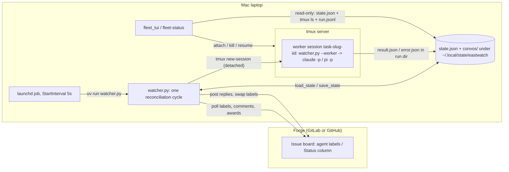
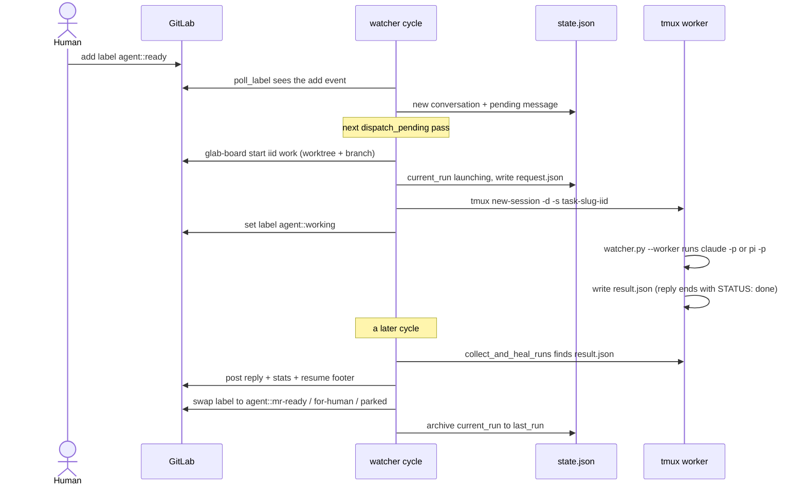
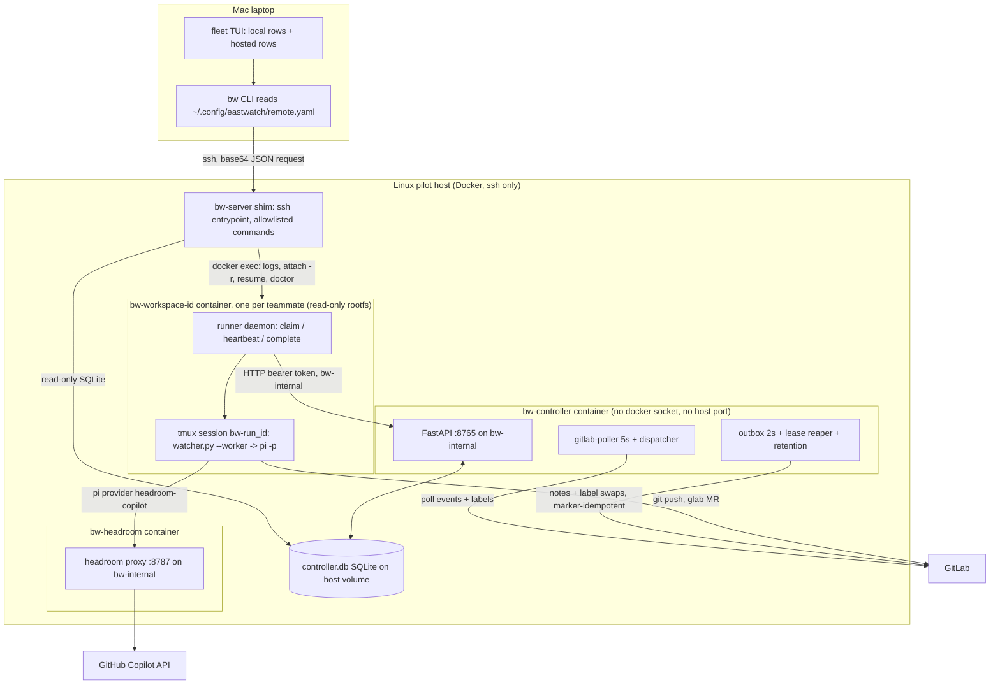
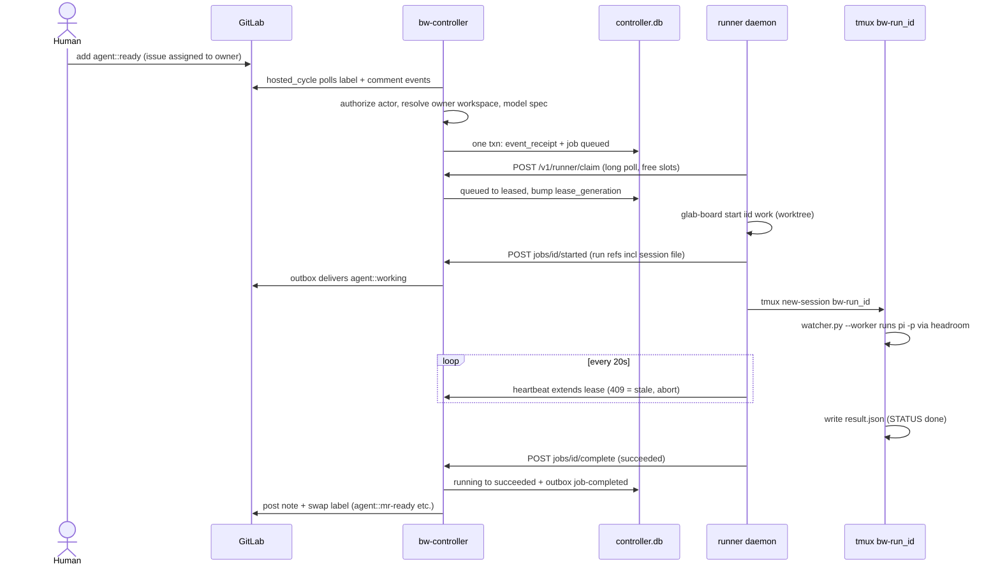
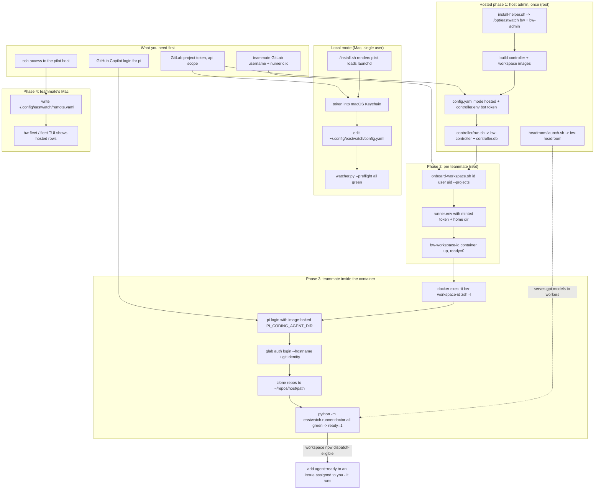
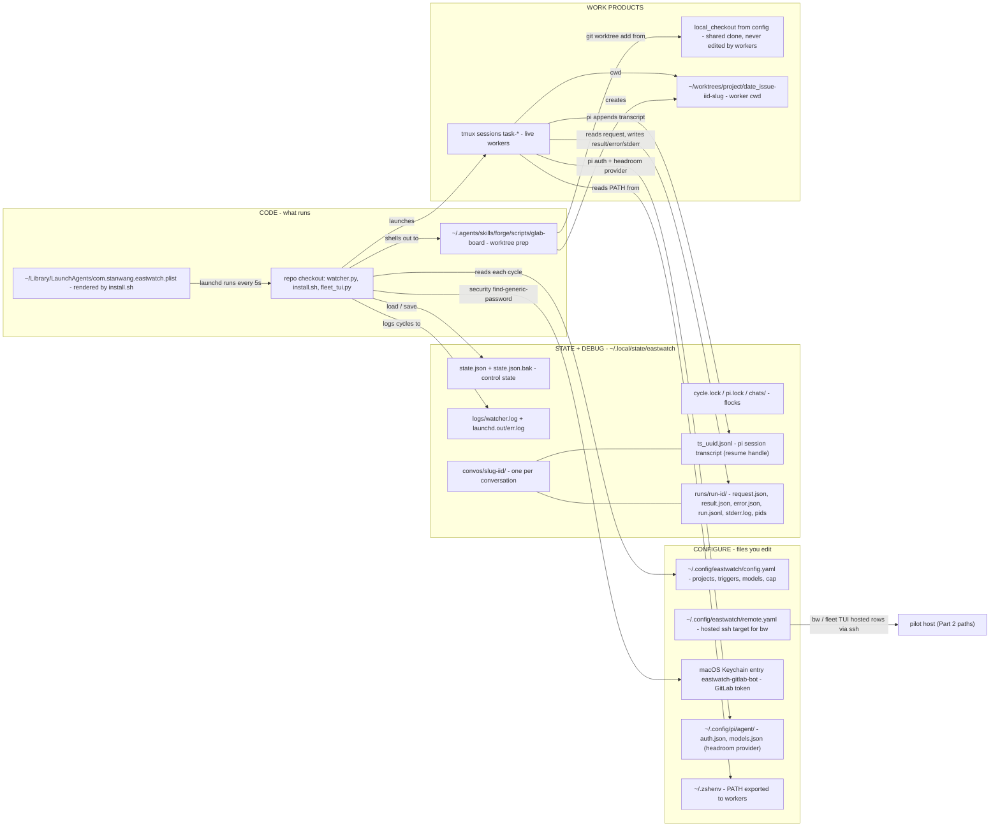

# eastwatch architecture

Top-to-bottom picture of how eastwatch works: first the original **local
mode** (one Mac, launchd, tmux), then the **hosted configuration** (Linux
server, Docker, controller + per-teammate workspaces). Diagrams are mermaid;
labels avoid HTML so they paste into Excalidraw.

The two modes are hard-fenced by config: `execution.mode: local` runs the
laptop watcher (`watcher.py:5863` refuses anything else), `execution.mode:
hosted` runs the controller (`controller/main.py:24` refuses anything else).
They share the label contract, the Forge `glab-board` workspace prep, the
`watcher.py --worker` process, tmux hosting, and the per-run artifact layout —
what changes is *who supervises* and *where state lives*.

---

## Part 1 — Local mode

### The one-sentence version

Every 5 seconds launchd runs one reconciliation cycle of `watcher.py`; the
cycle polls the board for gestures (labels, comments, awards), compares them
against `state.json`, launches detached tmux workers for new work, harvests
results workers left on disk, and posts replies + label swaps back to the
board. Workers outlive the cycle; the cycle is just a reconciler.

### Big picture



Key properties:

- **The cycle never blocks on a worker.** It launches and exits; the *next*
  cycle harvests whatever artifacts (`result.json` / `error.json`) workers
  wrote. `cycle.lock` (non-blocking flock) makes overlapping launchd fires
  exit immediately.
- **Liveness = live tmux pane, not pid.** `remain-on-exit on` keeps dead panes
  visible; `collect_and_heal_runs` treats a dead pane with no artifact as a
  crashed run.
- **State is one JSON file** (`state.json`, atomic write + `.bak` + a
  zero-project overwrite guard) plus per-conversation dirs under `convos/`
  holding pi session transcripts and per-run artifact dirs.

### One cycle, step by step

`main()` (`watcher.py:5849`): take `cycle.lock` → read
`~/.config/eastwatch/config.yaml` (fresh every cycle — no restart for
config/token changes) → `load_state()` → maybe daily artifact sweep →
`reconcile_projects` → `dispatch_pending` → `save_state`.

`reconcile_projects` runs three phases per project:

1. **Heal (serial)** — `collect_and_heal_runs`: harvest `result.json` /
   `error.json`, adopt sessions that outlived a launch crash, requeue
   interrupted launches, kill runs past the 3-hour deadline, synthesize
   failures for sessions that vanished.
2. **Poll (parallel)** — thread pool over projects: comment events
   (watermarked by `last_event_id`), trigger-label add events (deduped by
   `consumed_label_event_ids`), award emoji (set diff), or the GitHub
   Status poll.
3. **Commit (serial)** — `assemble()` coalesces gestures into per-conversation
   `pending` message lists, then state is saved per project.

`dispatch_pending` then walks conversations (numeric issue order), skips ones
with an active run, and calls `start_one` until the global `concurrency_cap`
(default 3) is hit.

### Dispatch and completion (sequence)



Details that matter:

- **Workspace prep** is delegated to Forge: `glab-board start <iid>
  work|research --json` returns `{worktree, branch}`; the worker's cwd is that
  worktree. Failure is non-fatal — the prompt then warns the worker off the
  shared checkout.
- **Two-phase launch**: `request.json` + `current_run: launching` are saved
  *before* the tmux launch. A crash between the two is healed next cycle
  (requeue the message, clear the active label) — work is never silently lost
  and never double-run.
- **Provider commands**: `claude -p --resume <sid> --output-format
  stream-json` or `pi -p --provider <p> --mode json --session[-dir] ...`.
  Models starting `gpt-` route `headroom-copilot` first with `github-copilot`
  as fallback (the headroom proxy serializes Copilot token exchange; locally
  it's a launchd job on 127.0.0.1:8787).
- **Completion protocol is a file, not an API**: the worker's last reply line
  `STATUS: done|parked` plus `result.json` on disk is the whole contract.

### Label lifecycle

The label *is* the claim. Scoped `agent::*` labels are mutually exclusive;
`set_issue_labels` swaps them atomically.

```mermaid
stateDiagram-v2
    [*] --> Ready: human adds agent::ready or ready-research
    Ready --> Working: dispatched (agent::working / researching)
    Working --> Parked: reply ends STATUS parked (agent::parked)
    Working --> MrReady: STATUS done with an MR (agent::mr-ready)
    Working --> ForHuman: STATUS done, no MR (agent::for-human)
    Working --> Failed: crash, timeout, vanished (agent::failed)
    Parked --> Working: thread reply, approval award, or agent mention
    Failed --> Ready: human re-adds the trigger label
    MrReady --> [*]
    ForHuman --> [*]
```

Other gestures (GitLab): an owner reply inside a bot thread resumes the
session; `@agent ...` starts a Q&A conversation; a ✅/👍 award on a parked note
means "approved — proceed"; a `[pi:model:effort]` hint in a comment switches
provider/model for the next run.

**GitHub difference (Status-first)**: the Projects v2 `Status` single-select is
the only command channel — dispatch fires on an observed transition *into*
Ready/Ready-research. The `agent::*` labels become a watcher-written shadow
(searchable receipt, never a trigger), and terminal Status writes refuse to
clobber a newer human drag.

### On-disk layout (local)

```
~/.config/eastwatch/config.yaml     read fresh every cycle
~/.local/state/eastwatch/
├── state.json (+ .bak)                 authoritative control state
├── cycle.lock / pi.lock / chats/*.lock flocks: cycle overlap, pi launch, chat
├── logs/watcher.log                    rotating cycle log
└── convos/<slug>-<iid>/                one dir per conversation
    ├── <ts>_<uuid>.jsonl               pi session transcript (resume handle)
    └── runs/<run-id>/
        ├── request.json                written by the cycle, read by worker
        ├── result.json | error.json    written by worker, read by next cycle
        ├── run.jsonl                   lifecycle journal (collector.py)
        └── stderr.log, wrapper.pid, child.pid
```

The fleet console is a pure read-side join of three sources — `state.json`,
`tmux list-panes`, and each run's `run.jsonl` — with actions (`attach`,
`resume`, `stop`, `dismiss`) shelling back into tmux or the fleet scripts.
GitLab/Jira tokens live in the macOS Keychain; Jira is read-only prompt
enrichment and never blocks dispatch.

---

## Part 2 — Hosted configuration

### What changes and why

Local mode is single-operator: one Mac, one keychain, one `owner`. The hosted
pilot moves execution to a shared Linux host so several teammates each get an
isolated **workspace container** with their own GitLab identity, while one
**controller** container owns polling, dispatch decisions, and all writes back
to GitLab. The laptop keeps only thin read/attach tooling over ssh.

The worker itself is unchanged — the same `watcher.py --worker request.json`
process inside tmux, the same `glab-board` worktree prep, the same
`result.json` contract. What got replaced is the supervision layer around it:

| | Local | Hosted |
|---|---|---|
| Supervisor | launchd, 5s | `bw-controller` container: poller thread 5s |
| Control state | `state.json` | SQLite `controller.db` (WAL, jobs/leases/outbox) |
| Forge writes | inline in the cycle | durable **outbox** with idempotency markers |
| Executor | same Mac, tmux `task-<key>` | runner daemon per workspace, tmux `bw-<run_id>` |
| Identity | single `owner` in config | per-issue assignee → owner's workspace; admins list |
| Secrets | macOS Keychain | env files (0600) + hashed runner tokens in SQLite |
| Concurrency | global cap 3 | per-workspace capacity + one job per conversation |
| Crash policy | heal + requeue | **never auto-retry**; lease loss → `agent::failed`, artifacts kept |
| Observability | local files + tmux | `bw` CLI over ssh → read-only SQLite + `docker exec` |

Hosted restrictions (pilot): GitLab only, `pi` provider only, model spec must
be in the workspace allowlist, no emoji-award approval yet, no Jira context.

### Topology



Network facts: `bw-internal` is a `--internal` Docker network (no NAT — this
is load-bearing; a plain bridge silently gives runners internet). Controller
and headroom publish **no host ports**; the only way in from the laptop is
ssh. Workspaces are dual-homed: `bw-egress` for GitLab/Copilot, `bw-internal`
for controller + headroom. The controller mounts neither the Docker socket nor
any workspace home. Headroom exists for one reason: parallel pi processes race
on Copilot token exchange, so a single proxy holds the one refreshed bearer
and workers use a static local key.

### Hosted dispatch, end to end



The moving parts:

- **Dispatcher** (controller): checks the durable event key
  (`host/path:label:event_id`) against `event_receipts` so a crash re-fires
  exactly once; authorizes the actor (assignee ∪ admins ∪ approved bots);
  routes the job to the assignee-owner's workspace (sticky affinity — there is
  no cross-workspace scheduler); rejects with a posted note when anything
  fails. Comments landing mid-run are queued on the conversation and coalesced
  into one follow-up dispatch when the current job ends.
- **Leases fence everything.** Claim sets `lease_generation`; heartbeats
  extend `lease_until`; every runner→controller write carries the generation
  and gets HTTP 409 if stale. The reaper returns expired `leased` jobs to the
  queue, and marks expired `running` jobs failed (`runner-lost`) — started
  work is never auto-retried; humans resume with `bw resume <job_id>`.
- **Outbox owns all GitLab writes.** Rows (`job-started`, `job-completed`,
  `runner-lost`, `dispatch-rejected`) are delivered with retry/backoff, and
  every note embeds an HTML marker so redelivery is idempotent. Completion
  delivery also validates claimed MRs (exist, owner-authored, carry the
  eastwatch marker) before choosing the terminal label.
- **Workspace readiness gates dispatch**: `python -m
  eastwatch.runner.doctor` inside the container checks
  git/glab/pi/tmux/forge/repos/models/controller and only then flips `ready=1`
  in the DB. `bw doctor` is the laptop remote-client wrapper.
- **Retention**: for successful runs whose MRs are all merged, a cleanup
  action (worktree remove, run dir + session delete, DB row compacted to an
  audit record) is scheduled 7 days after the last merge. Cleanup takes the
  same chat flock as interactive resume, so it can't race a human.

### Observing and steering from the laptop

Everything rides one ssh channel (multiplexed) to the `bw-server` shim, which
decodes an allowlisted base64 JSON request:

- `bw fleet --json` — read-only SQLite join, rendered as hosted rows in the
  same fleet TUI next to local rows (separate 6s poll so a slow ssh never
  stalls the local table).
- `bw logs <job> --follow --session` — `docker exec tail -F` of the pi session
  transcript from byte 0; the TUI dedupes replayed lines by hash (this pair is
  the ticket-032 live-trace fix, commit 57394fb).
- `bw attach <job>` — read-only `tmux attach -r` inside the container.
- `bw resume <job>` — refuses live panes, takes the session flock, then
  interactive `pi --session` in the worktree.
- `bw audit`, `bw doctor`, `bw open` (VS Code remote-ssh into the worktree).

### Host layout and onboarding (deploy story)

```
/opt/eastwatch/                 venv with bw + bw-admin, copied deploy/
/srv/eastwatch/controller/      config.yaml, controller.env (0600), data/controller.db, logs/
/srv/eastwatch/users/<id>/      runner.env (0600), home/  -> mounted at /home/bw
```

(Pilot-host caveat: the real pilot roots live under
`/srv/eastwatch`, not `/srv` — always pass
`BW_CONTROLLER_ROOT` / `BW_WORKSPACE_USERS_ROOT` to the run scripts.)

Onboarding a teammate = `onboard-workspace.sh <id> <gitlab-user> <uid>
--projects ...`: builds the workspace image, `bw-admin create-workspace`
(mints a hashed runner token, writes `runner.env`, starts the container),
installs the pi models template, then the teammate logs in *inside* the
container (`pi` `/login` with `PI_CODING_AGENT_DIR` set, `glab auth login
--hostname`, git identity, repo clones) until `python -m
eastwatch.runner.doctor` is green. Only the bind-mounted `/home/bw`
survives container respins.

### Setup at a glance

What you need, who does each phase, and what each step unlocks. Local mode is
the short strip on the left; the four hosted phases run top to bottom.



Reading the arrows: nothing dispatches until the workspace doctor flips
`ready=1`, and it only passes once phase 3 is complete — so the login/clone checklist is
enforced, not advisory. Phase 4 is optional for execution (the controller
dispatches without it); it's how you *watch and steer* from the Mac.

Cutover from local is deliberately boring: drain and stop the launchd job,
archive local state without importing it, start the controller, and verify its
first cycle **adopts** current board state with zero jobs — the same
adopt-don't-dispatch bootstrap rule local mode uses on a project's first
cycle.

---

## Part 3 — Path map: everything we touch on the Mac

**Where is the run dir?** Locally:

```
~/.local/state/eastwatch/convos/<project-slug>-<iid>/runs/<YYYYMMDDTHHMMSSZ-hex12>/
```

One dir per launch attempt; `<slug>` is the project path with slashes as
dashes (e.g. `convos/eci-store-madden-9/runs/20260806T101512Z-3fa2bc91d044/`).
Hosted, the same shape lives inside the workspace container at
`/home/bw/state/conversations/<slug>-<iid>/runs/<run-id>/`, which is the host
path `<users_root>/<workspace-id>/home/state/conversations/...` — that's why
the completion notes say `docker exec ... tail -f /home/bw/<run_dir>/run.jsonl`.

### The map



### Debugging order (local)

When a run misbehaves, walk outward-in:

1. `tail ~/.local/state/eastwatch/logs/watcher.log` — did the cycle see
   the gesture, dispatch, or fail? (`launchd.err.log` for crashes before
   logging starts.)
2. `scripts/fleet-status` (or the TUI) — derived state: queued / working /
   crashed / finished / parked.
3. The run dir — `request.json` is exactly what the worker was asked;
   `error.json` / `stderr.log` say why it died; `run.jsonl` is the lifecycle
   journal; no `result.json` + dead pane = crash.
4. `tmux attach -t task-<slug>-<iid>` — the pane stays after exit
   (`remain-on-exit`), so the provider's last screen is still there.
5. `state.json` — the conversation's `current_run`, `session_id`, `pending`;
   only edit via `fleet-dismiss` / `fleet-wipe-issue`, never by hand while the
   watcher runs.

Config knobs that redirect these paths: `EASTWATCH_CONFIG_DIR` /
`EASTWATCH_CONFIG_PATH` / `EASTWATCH_STATE_DIR` /
`EASTWATCH_LOG_DIR` / `EASTWATCH_GLAB_BOARD`, `WORKTREE_ROOT` for
glab-board, and `XDG_CONFIG_HOME` / `PI_CODING_AGENT_DIR` for pi. Sanity-check
the whole wiring with `uv run src/eastwatch/watcher.py --preflight`.

### Hosted path translation

The same run dir seen from three places:

```
laptop:      bw logs <job_id> --follow            (ssh + docker exec tail)
host:        <users_root>/<ws-id>/home/state/conversations/<slug>-<iid>/runs/<run-id>/
container:   /home/bw/state/conversations/<slug>-<iid>/runs/<run-id>/
```

Host-side need-to-knows: controller DB at
`<controller_root>/data/controller.db` (query via `docker exec bw-controller`,
never write from the host uid — stray `-wal`/`-shm` ownership silently freezes
the controller), `controller.env` / `runner.env` are the root-owned 0600
secret files, and on the current pilot the roots are
`/srv/eastwatch/{controller,users}`, not `/srv`.
