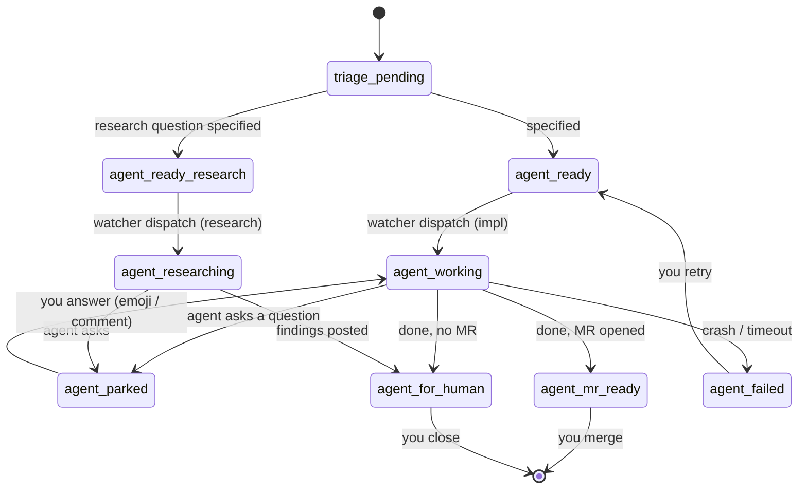

# Board label contract (unified)

**Status: ADOPTED 2026-07-18** (amended from the 2026-07-15 draft; the
amendment scoped the trigger and triage labels — rationale in §2). Canonical
home is this file; the forge skill's `REFERENCE.md` (dotfiles) mirrors it.
Read by: `forge`, `wayfinder`, `triage`, `to-tickets`, `to-spec`,
`code-review`, and the `eastwatch` service. Bootstrap/migration tool:
`glab-board setup` (forge skill) — idempotent labels + board columns on any
repo, GitLab and GitHub.

## Principle

**One vocabulary, platform-native authority.** On GitLab, the mutually
exclusive `agent::*` or `triage::*` label is the authoritative open-ticket
state. On GitHub, the canonical project's `Status` value is the authoritative
open-ticket state and the only lifecycle command channel.

**On GitLab, the `agent::*` label IS the claim. On GitHub, the `agent::*` or
`triage::*` label records the claim:** it is an eventually consistent,
searchable recovery shadow of the watcher's last observed Status; it is not a
command, is not a complete transition journal, and MUST NOT trigger dispatch.

(On GitLab the label — not the assignee — is the claim signal: every agent
session authenticates as the maintainer, so assignee is useless. GitLab auto-swaps
same-scope labels, so a card is in exactly one lane, always.)

## 1. Agent lifecycle — `agent::` scope (mutually exclusive)

| Label                   | Color     | Meaning                                    | Set by                                          | Board lane     |
| ----------------------- | --------- | ------------------------------------------ | ----------------------------------------------- | -------------- |
| `agent::ready`          | `#5cb85c` | specified, implement-grabbable — **watcher trigger** | triage / to-tickets / to-spec / human     | Ready          |
| `agent::ready-research` | `#45b39d` | specified, research-grabbable — **watcher trigger**  | triage (producer ticketed — see §7)    | Ready-research |
| `agent::working`        | `#1f883d` | implement run active                       | forge `grab` / watcher dispatch                 | Working        |
| `agent::researching`    | `#33aaff` | research run active                        | forge `grab research` / watcher (research kind) | Researching    |
| `agent::parked`         | `#f0ad4e` | paused, waiting on a human answer          | forge `park` / watcher (agent asked)            | Parked         |
| `agent::mr-ready`       | `#6f42c1` | done, MR opened, awaiting review           | watcher on completion **with** an MR            | Review         |
| `agent::failed`         | `#c0392b` | run crashed / timed out                    | watcher on wrapper failure                      | Failed         |
| `agent::for-human`      | `#337ab7` | done no-MR / decision needed               | watcher terminal (no MR) / forge                | For-human      |

## 2. Triage states — `triage::` scope (pre-dispatch, human-owned)

| Label                | Color     | Meaning                  | Set by           | Lane   |
| -------------------- | --------- | ------------------------ | ---------------- | ------ |
| `triage::pending`    | `#f0ad4e` | maintainer must evaluate | triage (default) | Triage |
| `triage::needs-info` | `#f7e463` | waiting on reporter      | triage           | —      |

`wontfix` (`#777777`) stays bare — it marks a *closed* disposition, not a lane.

**GitHub authority (round-2 amendment, 2026-07-18).** On GitHub, only
eastwatch writes state-shadow labels; humans change Status by dragging in
the canonical project, and agents and skills change Status through
`glab-board`. Any actor that discovers work through a state-shadow label MUST
re-read canonical Status before acting.

GitHub Status MUST have one option for every open state, including
`Needs-info`; exactly one corresponding state-shadow label may be present.
`hitl`, category, wayfinder, and `wontfix` remain authoritative orthogonal
labels, and Closed remains outside reconciliation.

**Amendment rationale (2026-07-18).** The draft kept triggers as bare labels
(`ready-for-agent`) on a namespace argument: human request vs agent claim.
Scoping them into `agent::` won because GitLab's scoped exclusivity then
*mechanically* strips the trigger at dispatch — adding `agent::working`
auto-swaps out `agent::ready` — which the draft's §4 wanted the watcher to do
by hand. On GitHub there are no scoped semantics; the forge script and watcher
enforce the same swaps with explicit removals. Triage states were scoped for
the same cohesion + exclusivity, and `needs-human` was renamed `for-human`
(reads as "agent output, for the human" — and keeps `agent::review` free in
case an agent-does-review trigger ever exists).

## 3. Orthogonal facets — filters, never lanes

- **Category** (exactly one per triaged ticket): `bug` `#d9534f`, `enhancement` `#5bc0de`
- `hitl` `#cc0033` — cannot proceed without Stanley. One query is his whole queue: `-l hitl`.
- `wayfinder:map|research|prototype|grilling|task` — the map issue + child-ticket type.
- `blocked` — GitLab-native, counts open blockers only.

## 4. Migration state

- `in-progress` → **retired**, replaced by `agent::working`.
- Old bare names (`needs-triage`, `needs-info`, `ready-for-agent`,
  `ready-for-research`, `ready-for-human`) → renamed in place by
  `glab-board setup` (rename keeps labels attached to existing issues).
- `agent::ready-research` producer rules for `triage` / `to-tickets` are
  ticketed in the dotfiles repo (stanley-910/dotfiles#4); until that lands the
  label is applied by hand.
- `agent::mr-ready` / `agent::failed` / research-kind `agent::researching` are
  produced by the watcher's terminal split (landed 2026-07-18).

## 5. Board lanes (one label per list)

- **What `glab-board setup` builds:**
  `Triage → Ready → Ready-research → Working → Researching → Parked → Review → Failed → For-human`
  (`triage::needs-info` is filter-only, no lane; Open/Closed are the built-in
  bookends.)

## 6. State machine

## 7. Migration checklist

- [x] Label renames + board columns — `glab-board setup` (forge skill,
  2026-07-18); idempotent, run once per project.
- [x] Forge `glab-board` — GitHub verb parity (park/close clear `agent::*`,
  native blocking, blocked-aware frontier); scoped-vocabulary sweep.
- [x] watcher.py constants + docs/tests — renamed to scoped trigger/human
  labels (2026-07-18).
- [x] **watcher.py terminal split** — produce `agent::mr-ready` (MR in
  `mr_index`) / `agent::failed` (`mark_failed`) / `agent::for-human` (done, no
  MR); set `agent::researching` for the research kind (2026-07-18).
- [ ] **`agent::ready-research` producer** — keep decided; the triage /
  to-tickets emission rules are ticketed in the dotfiles repo
  (stanley-910/dotfiles#4).
- [x] Retire `scripts/setup-demo-board.sh` — deleted 2026-07-18; the named
  demo board is no longer needed and `glab-board setup` covers bootstrap.
- [ ] **GitHub Status-first + label shadow** — Status is the authoritative
  state and only command channel on GitHub; the watcher mirrors transitions
  into state-shadow labels (ticketed in eastwatch#46, round-2 design
  review 2026-07-18). Includes: `Needs-info` Status option, canonical project
  node ID per repo (replace title lookup), triage/to-tickets/to-spec skills
  switch from label writes to `glab-board` Status verbs on GitHub.
